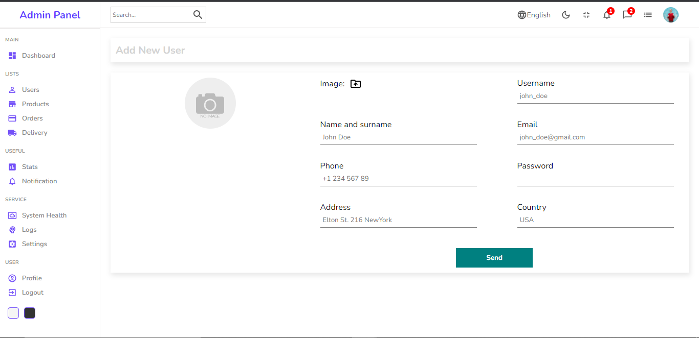

# Admin Panel

Admin Panel and developed using React, Typescript, Sass and Material UI.

## Features

- Admins can manage the products and users of the website.
- Users and Products data shown in table with pagination included.
- Visual representation using chart and progress bar.
- Users and Products can be added with images similar to CMS.
- Light and Dark mode.

## Tech

This application uses a number of open source projects to work properly:

- [React] - React is a free and open-source front-end JavaScript library for building user interfaces based on UI components. It is maintained by Meta and a community of individual developers and companies.
- [Typescript] - It is a strict syntactical superset of JavaScript and adds optional static typing to the language. It is designed for the development of large applications and transpiles to JavaScript.
- [Sass] - Sass is a preprocessor scripting language that is interpreted or compiled into Cascading Style Sheets. SassScript is the scripting language itself. Sass consists of two syntaxes. The original syntax, called "the indented syntax," uses a syntax similar to Haml.
- [Material UI (MUI)] - MUI offers a comprehensive suite of UI tools to help you ship new features faster. Start with Material UI, our fully-loaded component library, or bring your own design system to our production-ready components.

And of course this application itself is open source with every code available here in github.

## Installation

Requires [Node.js](https://nodejs.org/) v10+ to run.

Install the dependencies and start the server.

```sh
npm install
npm start
```

## Screenshot

##### Home


##### User


##### Create New User/Product


##### Dark Mode


## Performance Test


## Hosted
The link for the finished website - [Click Here](https://next-typescript-netflix-redesign.vercel.app/)

<!-- ## License

MIT -->
